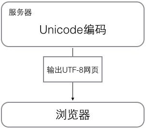

# 计算机系统通用的字符编码

## 数据结构(字符)

在计算机内存中，统一使用Unicode编码；当需要保存到硬盘或者需要传输的时候，就转换为UTF-8编码。  
用记事本编辑的时候，从文件读取的UTF-8字符被转换为Unicode字符到内存里，编辑完成后，保存的时候再把Unicode转换为UTF-8保存到文件：

![编码1]](../images/bianma-1.png)

utf-8编码的文件在内存中是unicode编码显示

浏览网页的时候，服务器会把动态生成的Unicode内容转换为UTF-8再传输到浏览器：

服务器把动态生成的Unicode内容转换为UTF-8再传输

所以你看到很多网页的源码上会有类似<meta charset="UTF-8" />的信息，表示该网页正是用的UTF-8编码。（UTF-8编码没有字节序的问题）

## 字符转化

+ **序列化**: 将一个数据结构（unicode编码， utf-8等）转化为二进制的数据流。用于存储，或者发送给网络中的其它程序。

不同的编码形成的二进制流不一样。

+ **反序列化**：与序列化相反，将二进制流重新恢复成更易于处理和阅读的数据结构

## python中的编码

+ Python中一切都是对象（object）。
+ 与字符编码类型有关的对象有str和bytes。

str对象存储的字符是UNICODE类型，bytes对象存储的字符就是一串byte。

+ str u'字符串以u开头'
> str.encode后得到的是一个bytes对象
+ bytes b'字节以b开头'
> bytes.decode之后，得到的是一个str对象。

 decode的作用是将其他编码的字符串转换成unicode编码，如str1.decode('gb2312')，表示将gb2312编码的字符串str1转换成unicode编码
