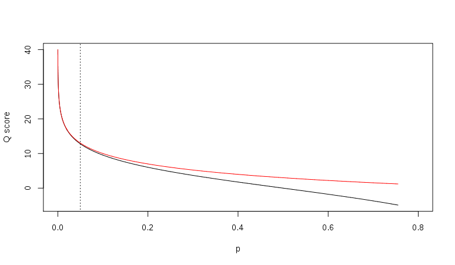

**FASTQ**是基于文本的，保存生物序列（通常是核酸序列）和其测序质量信息的标准格式。
其序列以及质量信息都是使用一个ASCII字符标示，最初由Sanger开发，目的是将FASTA序列与质量数据放到一起，目前已经成为高通量测序结果的事实标准。

---

# FASTQ基本格式(reads)

* 每条reads包括4行：

1. 序列标识以及相关的描述信息，以‘@’开头；
2. 第二行是序列
3. 第三行以‘+’开头，后面是序列标示符、描述信息，或者什么也不加
4. 第四行，是质量信息，和第二行的序列相对应，每一个序列都有一个质量评分，根据评分体系的不同，每个字符的含义表示的数字也不相同。

```text
1 @SEQ_ID
2 GATTTGGGGTTCAAAGCAGTATCGATCAAATAGTAAATCCATTTGTTCAACTCACAGTTT
3 \+
4 !''*((((***+))%%%++)(%%%%).1***-+*''))**55CCF>>>>>>CCCCCCC65
```

## Fastq ID

illumina测序仪的ID行一般包含测序仪、运行编号、flowcell ID、lane ID、tile ID、横纵轴坐标、索引序列等等

## 质量信息

* 质量信息代表一个碱基的错误概率的对数值
* Phred quality scores are logarithmically linked to error probabilities Phred

$$Q=-10log_{10}P$$

* 质量得分与错误概率的对应关系见下表：

Phred Quality Score (Q) | Probability of incorrect base call | Base call accuracy (P)
---|---|---
10 | 1 in 10 | 90 %
20 | 1 in 100 | 99 %
30 | 1 in 1000 | 99.9 %
40 | 1 in 10000 | 99.99 %
50 | 1 in 100000 | 99.999 %

除了Phred质量得分换算标准，还有就是Solexa标准：
$$Q_{solexa-prior to v.1.3}=-10log_{10}\frac{P}{1-P}$$

两种换算标准的比较：


Relationship between Q and p using the Sanger (red) and Solexa (black)
equations (described above). The vertical dotted line indicates p = 0.05, or
equivalently, Q ≈ 13.

* 对于每个碱基的质量编码标示，不同的软件采用不同的方案，目前有5种方案：
  * Sanger，Phred quality score，值的范围从0到92，对应的ASCII码从33到126，但是对于测序数据（raw read data）质量得分通常小于60，序列拼接或者mapping可能用到更大的分数。
  * Solexa/Illumina 1.0, Solexa/Illumina quality score，值的范围从-5到63，对应的ASCII码从59到126，对于测序数据，得分一般在-5到40之间；
  * Illumina 1.3+，[Phred quality score](http://en.wikipedia.org/wiki/Phred_quality_score)，值的范围从0到62对应的ASCII码从64到126，低于测序数据，得分在0到40之间；
  * Illumina 1.5+，Phred quality score，但是0到2作为另外的标示，[详见](http://solexaqa.sourceforge.net/questions.htm#illumina)
  * Illumina 1.8+

```text
SSSSSSSSSSSSSSSSSSSSSSSSSSSSSSSSSSSSSSSSS.....................................................
      ..........................XXXXXXXXXXXXXXXXXXXXXXXXXXXXXXXXXXXXXXXXXXXXXX......................
      ...............................IIIIIIIIIIIIIIIIIIIIIIIIIIIIIIIIIIIIIIIII......................
      .................................**J**JJJJJJJJJJJJJJJJJJJJJJJJJJJJJJJJJJJJJJ......................
      LLLLLLLLLLLLLLLLLLLLLLLLLLLLLLLLLLLLLLLLLL....................................................
      !"#$%&'()*+,-./0123456789:;<=>?@ABCDEFGHIJKLMNOPQRSTUVWXYZ[\]^_`abcdefghijklmnopqrstuvwxyz{|}~
      |                         |    |        |                              |                     |
     33                        59   64       73                            104                   126
     S - Sanger        Phred+33,  raw reads typically (0, 40)
     X - Solexa        Solexa+64, raw reads typically (-5, 40)
     I - Illumina 1.3+ Phred+64,  raw reads typically (0, 40)
     J - Illumina 1.5+ Phred+64,  raw reads typically (3, 40)
        with 0=unused, 1=unused, 2=Read Segment Quality Control Indicator (bold)
        (Note: See discussion above).
     L - Illumina 1.8+ Phred+33,  raw reads typically (0, 41)
```
