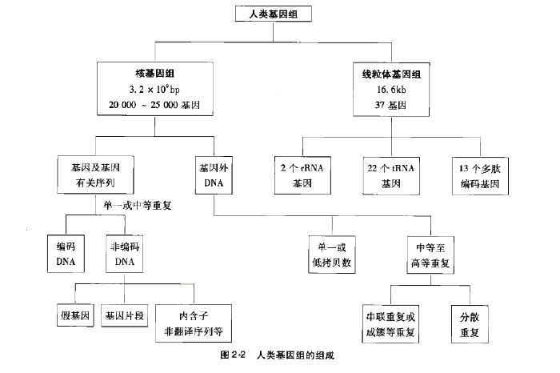
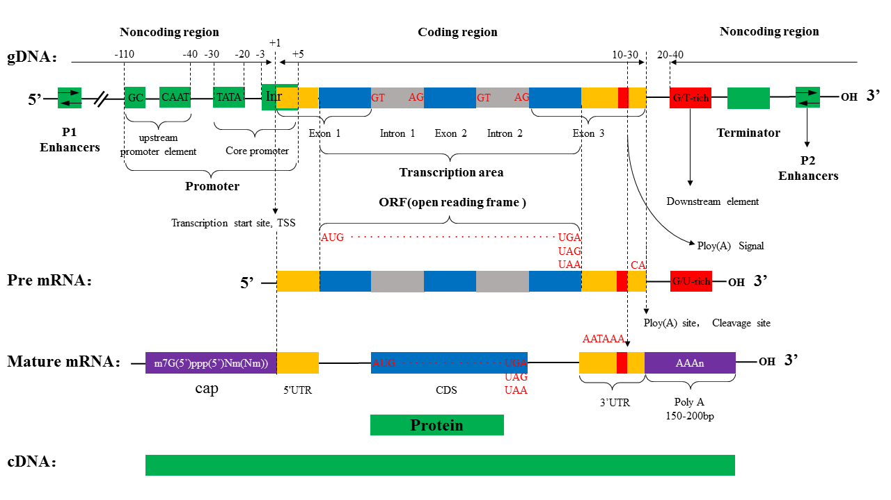
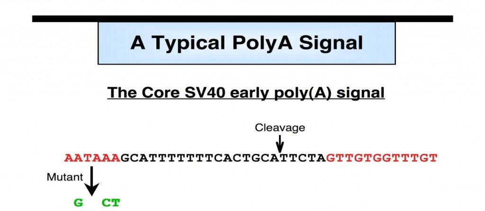

# 参考序列

+ XY染色体上相同序列 **PAR1** **PAR2**

  chrY:10001-2649520 and chrY:59034050-59363566
  chrX:60001-2699520 and chrX:154931044-155260560

+ 参考基因组中的多余序列

  The chr\*\_random sequences are unplaced sequence on those reference
  chromosomes.
  The chrUn\_\* sequences are unlocalized sequences where the corresponding reference chromosome has not been determined.

# 基因结构

{:height="100%" width="100%"}

1.**基因**： 表达基因产物的全部DNA序列,包括启动子、5'UTR、开放阅读框(open reading frame，ORF)、外显子、内含子、3'UTR以及调控区

+ **启动子**
    CAAT框(CAAT box)：其一致顺序为GGCTCAATCT，是真核生物基因常有的调节区，常位于转录起始点上游约-80bp处(或更远处)，可能也是RNA聚合酶的一个结合处，其突变敏感性决定转录效率，但是其突变不影响启动子的特异性。
+ **开放阅读框(open reading frame，ORF)：**
    在mRNA上从*起始密码子*到*终止密码子*之间的一段序列，该段序列可能编码蛋白质，也可能不编码；
+ **编码区(coding sequences，CDS):**
    CDS是检查cDNA后得到的编码组合序列，能翻译成氨基酸序列的DNA序列，从起始密码子到终止密码子，也就是说CDS与所翻译的氨基酸序列存在严格的3对1的关系；
+ **外显子与内含子分界**
    每个外显子与内含子的接头部位，都有一高度保守的共有序列，为剪接识别信号，即每个内含子5‘端的两个核苷酸都是**GT**，3‘端的两个核苷酸都是**AG**，这种连接方式称为**GT-AG**法则，是真核细胞中基因表达时剪切内含子和拼接外显子的共同机制。

2.**前信使RNA(precursor messenger RNA, pre-mRNA)**
又称heterogeneous nuclear RNA, hnRNA,是转录获得的最原始序列，没有经过任何加工，序列包含从转录起始位点到转录终止位点的全部序列；

3.**信使RNA(mRNA)**: 基因转录后加工成熟用于翻译蛋白质的序列，包括CDS序列、3'UTR、5'UTR、5'帽子及3'Poly(A)尾

外显子拼接形成成熟的mRNA，多数基因都有UTR,它们也是外显子拼接的产物，所以，mRNA的长度要大于CDS，只有CDS才编码蛋白，AUG以前的mRNA编码前导序列。

{:height="50%" width="50%" align="right"}

**3\`UTR的结构**: 3\`UTR是PolyA尾巴的载体，而加这个尾巴关键的是PloyA signal。这个信号位点在3`UTR富含T或GT和其上游AATAAA信号中间，大约离AATAAA20-25个核苷酸，这个位点叫Cleavage site。如果AATAAA发生突变，那么PolyA signal就不会被激活。

4.**cDNA**：通过mRNA反转录所得，与mRNA序列互补的单链DNA或者与mRNA对应的DNA双链；

5.**EST**：表达序列标签，是指从一个随机选择的cDNA 克隆，进行5’端和3’端单一次测序挑选出来获得的短的cDNA部分序列, 代表一个完整基因的一小部分，在数据库中其长度一般从20 到7000bp 不等，平均长度为360
±120bp。由于cDNA文库的复杂性和测序的随机性，有时多个EST代表同一基因或基因组，将其归类形成EST簇（EST cluster)；

过程|模板|原料|特点|引物
:---:|:---:|:---:|:---:|:---:|:---:
DNA复制|双链DNA|四种dNTP|合成的新链与模板链一模一样，半保留复制|需要
转录|双链DNA|四种NTP|合成的新链除了把DNA上的T改为U外，其他一样，半不连续转录|不需要
翻译|mRNA|20种游离的氨基酸|3个碱基决定一个氨基酸|
